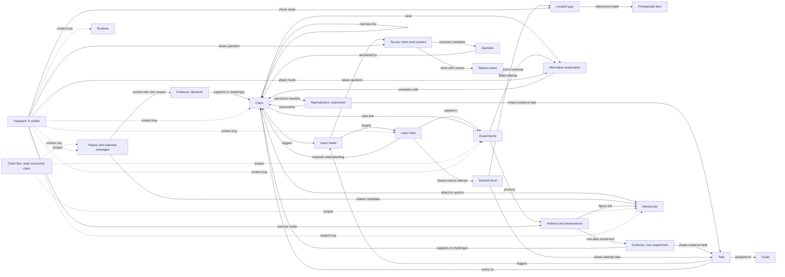

# Thinking OS UI Summary

Snapshot: September 16, 2026.

**Research**, **Learn**, **Tasks**, and the **Assistant dock** are described as target designs (revised 2026-09-16). **Runtime** is described as currently built.

## Product Purpose

Thinking OS is a local-first research workspace. Its canonical research chain is:

`Question -> Claim -> Evidence`

Experiments test Claims and produce artifacts. The Manuscript synthesizes Claims, citations, and artifacts. Tasks, learning material, runtime tools, and the Assistant support this workflow.

## UI at a Glance

The left rail exposes **8 workspace surfaces**:

- **2 primary surfaces:** Tasks and Runtime.
- **5 Research tabs:** Argument Map, Survey, Papers, Experiments, and Manuscript.
- **1 Learn surface:** Learn, with Needs, Items, and Today views.

The application shell also contains:

- A top bar for workspace selection, appearance, font size, and application settings.
- A central canvas that shows one active surface.
- A persistent Claim Bar above the canvas, shown on every Research subtab.
- A persistent daily-minimum strip on the Tasks surface.
- A bottom Inspector that appears when an Argument Map link is selected.
- An Assistant dock that can sit on the left or right, with named modes and an explicit context tray.
- A task editor modal that opens above the current surface.

## Research: Target Design

> **Status:** this section is a target design, revised 2026-09-16. It is not the current build. Sections after `Other Main Surfaces` still describe current behavior unless marked otherwise.

The Research area keeps **5 subtabs** and keeps the graph. The structural change is not navigation. The change is that a Claim now carries an explicit **trust state**, that state is **derived from links**, and it is **visible on every subtab** through a persistent Claim Bar.

Rationale: the two steps that carry the value of a research cycle are (1) reproducing the published baseline before testing your own idea, and (2) running controls that can only destroy your result. Neither step had any representation in the previous design. A Claim before the baseline is reproduced and a Claim after three surviving controls were the same object, displayed identically, and attachable to the Manuscript identically.

### Research Shell: the Claim Bar

A persistent strip above the canvas, present on all 5 subtabs.

**Contents:**

- **State counts:** candidate, committed, instrumented, contested, defended, retired. The retired count is shown next to the live counts on purpose: a healthy exploration phase retires far more candidates than it promotes.
- **Active claim:** one Claim is selected globally. It scopes the other subtabs. Papers shows passages relevant to it, Experiments shows its runs, Manuscript highlights the sections that depend on it. `All claims` is also a valid scope.
- **Workspace constraints:** contribution type (`solve` / `measure` / `explain`) and the available compute and data budget. These are inputs to the feasibility decision in Survey and to the completeness rule in Experiments.

**Why a bar and not a sixth subtab:** the claim set is context for every other action. Context behind a tab is consulted only when the user already suspects a problem. The bar shows weakness while the user is doing something else.

**Clicking a state chip** filters the current subtab to claims in that state.

### Claim Lifecycle States

States are **derived from links, never typed in by the user**. A state that can be set by hand is a state that will be set inaccurately.

| State | Entry condition |
| --- | --- |
| Candidate | Promoted from Survey or Learn. Falsifiable, settleable within one year. |
| Committed | Prediction and failure threshold written, before any linked experiment leaves `Planned`. |
| Instrumented | A Reproduction record exists: baseline identity, published number, reproduced number, gap. |
| Contested | At least one open Alternative Explanation is attached. |
| Defended | Every attached Alternative Explanation is removed by a Control, and scope limits are written. |
| Narrowed | Superseded by a successor Claim. The dead Claim remains visible and is the parent of its successor. |
| Rejected | Failure threshold was met. Remains visible, never deleted. |

**States are descriptive, not blocking.** The UI never refuses an action. It marks the consequence. An uninstrumented Claim can be attached to a Manuscript section, and the section then displays that fact. The user is allowed to build on weak ground and is never allowed to forget it.

### New Object Types

- **Reproduction:** a first-class record linked to a Claim. Fields: baseline identity, published number, reproduced number, gap, evaluation script hash, date. A Claim without one is `uninstrumented` everywhere it appears.
- **Alternative Explanation:** a competing explanation attached to a Claim. States: `open`, `removed by control`, `damaged result`.
- **Evidence provenance:** `Evidence.source` is either `literature` or `own-experiment`. The two must never render identically.
- **Retire reason:** required to retire a Survey note. One of `solved since` (with citing paper), `infeasible` (with the blocking resource), `already stated` (with reference).
- **Novelty check:** per Claim. Fields: date checked, search performed, result.

### 1. Survey

**Purpose:** generate candidate problems, and destroy most of them.

**Main areas:** Loose Open Problems, Candidate Question Clusters, and a collapsed Retired lane.

**UI:** text cards in two columns, drag to cluster. **No graph on this subtab.** Relationships here are fuzzy similarity, not typed links. A graph would invite the user to draw edges between untested notes, which asserts structure that does not exist yet.

**Filters:** All, Clustered, Stale, Retired. `Stale` means the note's freshness check against citing work is older than six months.

**Behavior:**

- A note records the survey paper it came from and the date its citing work was last checked.
- Promotion is unchanged: user-written claim, falsifiability, one-year horizon. Promotion creates a Question, a Claim in state `candidate`, and their link.
- **Retire** requires one reason from the fixed set. Retired notes stay searchable. Without this, the reasoning behind a field choice is lost and the same dead ends get re-read next year.

### 2. Argument Map

**Purpose:** the research hub. Holds Claims, their trust state, their support, and the attacks against them.

**Main objects:** Questions, Claims, Evidence, Reproductions, Alternative Explanations, and the links between them.

**Internal views:**

- **Map:** pan-and-zoom graph of the argument.
- **Ledger:** a table of all Claims. Columns: state, threshold written, instrument present, own-evidence count, alternatives raised, alternatives open, scope limits written, novelty checked. This view answers "which of my claims can I trust", which is a comparison across claims. Tables beat graphs for cross-node comparison.
- **Detail:** editor for one object. A Claim carries prediction, failure threshold, scope limits, and lineage.

**Filters:** All, Holds, Weak, Missing (link states, unchanged) plus the state chips from the Claim Bar.

**Graph visual encoding:**

- Node fill encodes trust state: neutral for candidate and committed, positive for instrumented, warning for contested.
- Evidence nodes are visually split by provenance. Evidence the user produced and evidence from a paper must never look the same.
- Alternative Explanations are nodes attached by a `challenges` edge. A removed Alternative keeps its node with the edge struck through, rather than being deleted. Empty space around a Claim then means "nobody has attacked this yet", which is information.

**Inspector (bottom, on link selection):**

- Existing actions: reasoning check, weaken, reject, plan experiment.
- Added: `add alternative explanation`, `add control for this alternative`, `narrow into successor claim`.
- `Narrow into successor` creates a new Claim with the dead one recorded as parent. A failed claim is usually the parent of the real result, and that lineage is the project's intellectual history.

### 3. Papers

**Purpose:** external evidence, novelty checking, and citation metadata.

**Internal navigation:** Vault, plus one dynamic tab per opened paper.

**Vault filters:** All, Highlights, Linked, `Published after <date>` (used for the freshness pass over work citing a survey).

**Reader actions:** Ask, Evidence, Highlight (unchanged).

**Behavior:**

- Evidence created here is tagged `provenance: literature` automatically. There is no user choice, so it cannot be mislabeled.
- When a Claim is active in the Claim Bar, the `Evidence` action skips the parent-claim picker and goes straight to the reason field. The written reason stays mandatory.
- The novelty log lives here, per Claim. A Claim never novelty-checked is flagged in the Ledger.

### 4. Experiments

**Purpose:** produce the user's own numbers.

**Two axes, not one:**

- **Status:** All, Planned, Running, Done.
- **Kind:** `Reproduction` (the baseline instrument), `Test` (tests the Claim), `Control` (removes one named Alternative Explanation, and links to the Alternative rather than to the Claim).

**Main content:** Claims with their attached experiments, design fields (target metric, baseline, prediction, failure condition, scope), artifacts with path and content hash, and recorded observations.

**Behavior:**

- Grouping stays by Claim. Inside each group the Reproduction slot is pinned at the top, and **when it is empty the empty slot is still drawn**, labeled `no instrument`. A missing thing that is not rendered cannot be noticed.
- **Creation happens here** as well as from the Map Inspector. The creation form requires the Claim, the prediction, the failure threshold, and one further question: *what is the Claim's status if this succeeds, and if it fails?* If both answers are identical, the experiment is marked `decorative`. This implements the stop rule: run an experiment only if either outcome changes the truth value of a Claim.
- **Artifact to Evidence in one action.** A completed artifact plus a written observation becomes an Evidence record with `provenance: own-experiment`, linked to the Claim.

### 5. Manuscript

**Purpose:** assemble defended Claims into an argument.

**Internal views:** Composer, Argument Storyboard, Preprint Reader (all kept).

**Composer side tools:** Synthesis Locker, Citation Manager (both kept).

**Behavior:**

- Vault-backed, not browser `localStorage`. The reason is not only portability: a figure slot must be able to reference a *Planned* experiment and render as unfilled, which is impossible while the Manuscript sits on a different lifecycle from the rest of the workspace.
- Figures are planned before the experiments exist. Each figure slot is attached to exactly one Claim.
- Each section shows a trust summary: how many of its Claims are uninstrumented, how many Alternatives against them are still open. The Storyboard totals this for the whole manuscript.
- Attaching an uninstrumented Claim is allowed and marked.

### Research Link Model

Every link keeps its mandatory user-written reason. Claim state is derived from the links in this table.

| From | To | Link type | Required from the user |
| --- | --- | --- | --- |
| Survey note | Question, Claim | promote | claim text, falsifiability, one-year horizon |
| Survey note | Retired | retire | one reason from the fixed set |
| Question | Claim | answered by | — |
| Evidence (`literature`) | Claim | supports / challenges | written reason |
| Evidence (`own-experiment`) | Claim | supports / challenges | written reason and observation |
| Reproduction | Claim | instruments | published number, reproduced number |
| Alternative Explanation | Claim | competes with | statement of the alternative |
| Control experiment | Alternative Explanation | removes | the outcome that counts as removal |
| Claim | Claim | narrows into | why the parent failed |
| Claim | Manuscript section | supports section | — |
| Task | Claim, Experiment | works on | — |

## Other Main Surfaces

### Tasks (Target Design)

> **Status:** target design, revised 2026-09-16. Not the current build. See `Build Condition` below: one open question determines whether this design should be built at all yet.

**Purpose:** record what was produced, not what was attended to. Tasks connects the current claim cycle, daily delivery, and weekly honesty about whether evidence appeared.

**Diagnosis of the previous design.** A Kanban board with manual completion measures card movement. A week in which five cards reach `Done` and a week in which one baseline is reproduced look the same on the board, and only the second one changed what can be trusted. Tasks also linked to Goals but not to research objects, so drift could only be judged against one-year milestones, which are too coarse to detect a wasted week.

**The metric.** The output question is: *what exists now that did not exist before?* In this workspace that set is countable — a Reproduction, an Evidence record, a removed Alternative Explanation, a retired Survey note with its reason, a recorded Learn Attempt, a Claim that changed state. Input metrics such as papers read or hours studied are deliberately not tracked. They would reward the reading that the Survey retire filter and the Learn stop rule exist to prevent.

#### Task Kinds and Derived Completion

| Kind | Produces | Completion |
| --- | --- | --- |
| **Evidence** | A Research object: Reproduction, Evidence record, removed Alternative, retired Survey note, promoted candidate | **Derived.** Done when the target object exists. |
| **Attempt** | A closed-source Learn Attempt | **Derived.** Done when an Attempt is recorded. Pass and fail both complete the Task. |
| **Build** | Code, infrastructure, scripts | Manual, against a written definition of done. |
| **Maintenance** | Install, configure, admin, correspondence | Manual. First-class in the Pipeline, excluded from the weekly evidence count. |

Same rule as Claim state and Learn level: completion is derived where an object can certify it. A checkbox measures intention; an object that exists measures the work.

Two consequences:

- A **failed** Attempt completes its Task. The commitment was to attempt, not to succeed. Rewarding only success would push the user away from hard items.
- `Read paper X` is not a valid Evidence task. It becomes `extract one Evidence record from X` or `retire note N using X`. Reading with no output is `maintenance`, labelled honestly. This raises reading quality without ever asking for reading volume.
- A Task of kind `evidence` with no linked research object is invalid and cannot leave `Backlog`.

#### Internal Tabs

- **Direction.** Five-year North Stars are removed: a five-year plan is unfalsifiable, unactionable, and produces the feeling of direction at no cost. Replaced by (1) one long-horizon sentence, kept as a filter for choosing work rather than as a plan with milestones, (2) the **current claim cycle** — the frozen claim set being defended and its written terminal condition, a horizon of weeks to months, and (3) at most one next-cycle candidate. More than one candidate is a wish list.
- **Pipeline.** Kanban with Backlog, This week, Doing, **Verify**, Done. `Review` is renamed to `Verify` and given a definition: the output exists but has not been compared against the criteria written before starting. A card resting in `Verify` is itself a signal, because it usually means the user does not want to check. Each card shows its kind and the research object it advances.
- **Weekly Review.** Three questions in order. (1) What exists now that did not exist last Monday, counted from Research and Learn rather than from the board. (2) Which Claims moved state, and which have been static too long. (3) **Classify the week:** evidence, maintenance, blocked, or drift. The classification matters more than the counts. A maintenance week is legitimate; a drift week is not, and only the user can tell them apart. Forcing the label weekly makes a two-month pattern visible that no single week can show.

#### The Daily Minimum

A persistent strip on the Tasks surface. This is the only part of the design aimed at habit formation.

The minimum is one of two things, each under five minutes: **one cheap `state` Attempt**, or **one passage converted to Evidence or one note retired with a reason**. Binary, daily.

Deliberately absent: streaks, points, and reward language. A rolling 14-day window shows whether the behavior is occurring but does not accumulate into a score worth protecting. A long streak is exactly what causes a paper to be skimmed late at night to keep it intact. Five minutes is chosen so that lack of time is never a true explanation, which makes a missed day information rather than an excuse.

#### Rejected Alternative

**A habit tracker with daily input targets and streaks** — papers read per day, minutes studied. Well proven for habit formation and probably more reading in month one. Rejected because it optimizes the quantity the Research design exists to reduce, and because a timer cannot distinguish a skimmed paper from a studied one. The daily minimum keeps the same formation mechanism (small, fixed, daily, low threshold) attached to an output that cannot be produced without doing the work.

#### Known Risk

Derived completion can make the board feel obstructive. Much real work produces no research object: a broken driver, a dependency conflict, a day inside the vault sync code. If those Tasks feel second-class, the board gets abandoned for a text file, and then the weekly review has no denominator and the drift share cannot be computed. Mitigation is partial: `build` and `maintenance` are fully normal in the Pipeline, and the weekly review reports them as a share, in neutral wording, rather than as failure.

#### Build Condition

One question decides whether this design should be built now, and it is open as of 2026-09-16: **what share of working hours currently goes into building this application versus doing research with it?**

- If research is running — there is an active Claim and at least one instrument — build as specified.
- If the application is the real project right now, the evidence counters will read zero every week for reasons unrelated to the quality of the work, and the weekly review would report failure while measuring a cycle that is not running. In that case build only the Pipeline with `kind` and the daily minimum strip, and leave the Weekly Review counters and the drift threshold until a claim cycle exists.

#### Connection

A Task links to a Claim, Experiment, Alternative Explanation, Survey note, or Learn Item through `works on`, and optionally to a Goal through `goalId`. Creating the linked research object closes the Task; recording a Learn Attempt closes an Attempt Task. A Task can trigger a Learn Need. Direct promotion from Learn into a Task is removed. The claim cycle on Direction serves a Goal.

### Runtime

**Purpose:** Inspect and operate the local execution environment used by the workspace.

**Internal tabs:**

- **Services:** Local processes and service commands.
- **LLM Models:** Available local model checkpoints.
- **Agent Jobs:** Runs and job activity.
- **Environment:** Agent configuration and environment details.

**Connection:** Runtime objects can be attached to the Assistant for diagnosis. Runtime currently supports research work, but it is not directly linked to Questions, Claims, or Evidence.

### Learn (Target Design)

> **Status:** target design, revised 2026-09-16. Not the current build. The build is staged; see `Staged Build` below. Stage 1 is the only part that should be built before the habit it depends on exists.

**Purpose:** own material well enough to use it without the source in front of you. The surface exists to test production, not to store capture.

**Diagnosis of the previous design.** Every state the old surface could reach — captured, on the board, promoted — was reachable by reading. Capture is the cheap half of learning and produces the same feeling of progress as understanding, at a fraction of the cost. So the surface could be used heavily and record nothing about whether the material was usable. Adding a level field would not fix this; it would only let the user declare what the surface cannot check.

**The mechanism this design is built on.** A gap in understanding is produced by attempted production, never by reading. Reading hides gaps because the author supplies the step order. Therefore the surface needs one state that can only be reached by producing something with the source closed, and levels must be derived from that act.

#### Object Model

| Object | Role | Key fields |
| --- | --- | --- |
| **Need** | Why a source is open. The unit of learning is a question, not a book or a chapter. | question, trigger, target level, stop rule, state (`open` / `served` / `dropped`) |
| **Item** | One concept, theorem, or result to be owned. | statement, hypotheses, source ref, source year, `durability`, `kind` |
| **Attempt** | One closed-source production. The core object. | date, target level, produced text, outcome, resulting gap |
| **Gap** | A located failure at step granularity, not item granularity. | failing step, originating attempt, state (`open` / `fixed`) |
| **Prerequisite** | Item to Item, directed. Created only from an open Gap. | source gap |
| **Limit** | A counterexample, or the condition under which the Item fails. | hypothesis dropped, what breaks |
| **Reference note** | A formula, value, or citation that will be looked up. | Excluded from levels and from the queue. |

Two fields carry decisions that are cheap to store and expensive to omit:

- **`durability`:** `mathematical` (does not expire) or `empirical` (expires). A 2016 source is current for maximum likelihood and stale for architecture practice. This field makes source age visible instead of silent.
- **`kind`:** `operative` (must fire unprompted, so it must be internal) or `reference` (will be looked up, so externalize fully). Reference items are never tested and never queued. Treating the two alike is what lets a system report learning when it has only recorded storage.

#### Levels, Derived Not Typed

| Level | Certified by |
| --- | --- |
| Vocabulary | The Item exists, no Attempt. **Terminal and legitimate.** Most items stop here. |
| State | A passed Attempt reproducing the statement **with its hypotheses** |
| Derive | A passed Attempt reproducing the argument, with step order chosen by the user |
| Apply | A link to an Experiment or Claim where the Item was used on a new instance |
| Limit | A Limit object exists |

Levels are computed from Attempts and links. They are never set by hand, for the same reason Claim state is derived: a level that can be typed in will be typed in on a confident day and will be wrong a week later.

`Apply` is derived from a link into Research rather than from an Attempt, because applying is not a writing act and cannot be certified inside Learn.

#### Internal Tabs

- **Needs:** intake, and the only place a stop rule lives. A Need's trigger is either a Claim, Experiment, or Task (`instrumental`, target defaults to `apply`) or nothing (`curiosity`, target defaults to `vocabulary`). `Served` and `dropped` are both success states and render with equal weight. Closing a Need because the problem is solved must not look like abandonment.
- **Items:** the material and its prerequisite structure. Default view is a **list** grouped by Need, sorted by level, marking items blocked by a lower-level prerequisite. A **prerequisite graph** is the second view. Reason: the daily question is "what do I do now", which a list answers; the graph answers "why am I stuck", which arises less often. A graph is justified here, unlike on a note board, because prerequisite edges are directed and objective rather than associative.
- **Today:** the queue, in priority order. Open Gaps, then Attempts due for re-test (operative items only), then Needs with no Attempt for over a week. Nothing else. No inbox of captured material.

#### The Attempt Screen

This screen is where the design either works or becomes decoration.

- Entering an Attempt **hides the source panel, the Item's own statement, and every note attached to it**. The editor starts empty.
- The outcome is recorded **before** the source reopens: passed, or failed with the failing step named in one line.
- On failure, exactly two follow-ups are offered: fix that step only, or add the missing input as a prerequisite Item.
- After the source reopens the text may be corrected, and the correction is stored as a by-product. The Attempt keeps its original outcome. Editing an answer after seeing the source must not be able to convert a failure into a pass.
- A **cheap Attempt** targets `state` only: write the statement with its hypotheses, two to three minutes. The expensive `derive` Attempt is reserved for Items that a Claim actually requires.

A single-user tool cannot enforce honesty. It can only make the honest path the default and the dishonest one an explicit action. Hiding the source by default is that mechanism.

#### Removed From the Previous Design

- **The Board of visual knowledge blocks.** A block is a captured fragment with no owner question and no test.
- **Direct promotion from Learn into a Claim or Question.** Learning generates questions at high rate and low quality. They must pass the same freshness and feasibility filter as everything else, so Learn raises a **Survey note** and nothing stronger.
- **Promote-to-Task.** Kept only as a Need with a Task trigger. A learning item that becomes a Task without a question is how reading lists form.

Kept: Today as a queue concept, and source-centred reading of the material.

#### Rejected Alternative

**Spaced repetition over captured cards.** Mature, proven, and much cheaper to build. Rejected because card review certifies `state` and stops there, while the value of instrumental learning comes from `derive` and `limit`, which need multi-step production and a counterexample. A card system would produce reliable recitation of definitions that still cannot be used. Spacing itself is kept, applied to Attempts at the Item's current level rather than to cards.

#### Known Risk

The Attempt is expensive and expensive steps get skipped. If Attempts stop, the queue fills with untested items, the `vocabulary` column grows, and the surface becomes a guilt archive with more structure than the Board it replaced. The cheap `state` Attempt is a partial defense, not a solution. **This risk is the reason the build is staged.**

#### Staged Build

As of 2026-09-16 the user reports zero closed-source production attempts in the previous month, and little learning activity of any kind. The Attempt is therefore an unpractised habit, and the later stages would be built on top of an unproven assumption. Each stage has an entry condition measured from use, not from a plan.

| Stage | Build | Entry condition |
| --- | --- | --- |
| **1** | Item, `kind` and `durability` fields, the cheap `state` Attempt with the source hidden, Reference notes kept separate. No Needs tab, no Gaps, no prerequisites, no spacing. | None. Build now. |
| **2** | Gap, Prerequisite, Needs tab with triggers and stop rules, Today queue. | Roughly 10 Attempts recorded across at least 3 separate weeks. |
| **3** | Spacing schedule, prerequisite graph view, `derive` and `limit` levels, and the `Claim requires understanding Item` link with its competence flag on the Claim. | At least one Item reached `apply` through a real link into Research. |

If Stage 1 sees no Attempts within a month of being built, the correct conclusion is that this workspace is not where learning happens, and Learn should be reduced to a reference index with source ages: Items of `kind: reference` only, no levels and no queue.

**Connection:** a Need is triggered by a Claim, Experiment, or Task. An Item reaches `apply` by being linked to an Experiment or Claim. A Claim can declare the Items it requires, and shows a competence flag when a required Item is below `derive`. Questions raised while learning enter Survey as notes.

## Assistant Dock (Target Design)

> **Status:** target design, revised 2026-09-16. Not the current build. Build order is given at the end of this section.

**Purpose:** the Assistant is a tool for thought, not a producer of research output. It accelerates the steps whose value does not come from being slow, and it attacks the work it is not allowed to author.

### The Governing Rule

**The Assistant may never author anything that certifies a derived state.**

Every state in this workspace is derived from objects: Claim state from links, Learn level from Attempts, Task completion from produced objects. If the Assistant can write those objects, every derived state becomes a measurement of the model rather than of the user, and the workspace reports competence that does not exist.

| Never authored by the Assistant | Reason |
| --- | --- |
| Link reasons in the Argument Map | This is what makes the argument the user's own |
| A closed-source Learn Attempt | The value is the retrieval, which assistance removes |
| A Claim or a formal Question | Must pass the Survey promote or retire filter |
| The observation on an experiment artifact | This is the interpretation that becomes Evidence |
| Marking an Alternative Explanation removed | This is the judgment that a Control was sufficient |
| Scope limits on a Claim | This is what the user defends under questioning |

Everything else is permitted and should be fast.

### Where the Assistant Is Strong, and Where It Is Not

A note on a common inversion: "automate the known, explore the unknown" is the wrong direction. In the known domain the Assistant is reliable and errors are cheap and detectable. In the unknown domain it produces plausible mechanisms, confident causal direction, and references that do not exist, and the user has no basis for catching them — that is what makes the domain unknown.

The correct split is: **automate the known, and in the unknown use the Assistant adversarially rather than generatively.** Not "propose what might be true", but "attack the claim I already wrote". A bad generated objection costs one minute to dismiss. A bad generated finding can cost a month of experiments.

### Modes

An open chat box makes every capability available at once, but the constraint is per task. The dock therefore has named modes with different write permissions, enforced by tool allowlists rather than by prompt text.

| Mode | Reads | Writes | Purpose |
| --- | --- | --- | --- |
| **Retrieve** | Vault, papers, web | Nothing | Find, locate a passage, summarize. The safe majority of use. |
| **Attack** | The active Claim and its evidence | Alternative Explanations, state `open` | The unknown-domain mode. Generates objections the user must then remove. |
| **Check** | An argument the **user already wrote** | A Gap candidate | Names the step that breaks. Supplies the fix only on a separate request. |
| **Execute** | Runtime, code, data | Artifacts, logs, scripts | Never the observation on an artifact. |
| **Explain** | Anything | Nothing | Teaching. **Hard-disabled while a Learn Attempt is open.** |

The Attempt lockout is absolute, not a warning. While an Attempt screen is open the Assistant is unavailable in every mode. An Assistant reachable during a closed-source attempt makes the Attempt worthless in a way the user will not notice.

### Provenance: the `authored` Field

Every object carries `authored: user | assistant | assisted`.

- `assisted` means the Assistant drafted and the user edited. This is honest, common, and worth distinguishing from both extremes.
- The Argument Map Ledger shows, per Claim, how much of its argument the user wrote. A Claim whose alternatives, reasons, and observations are all `user` is a different object from one where half is `assistant`, and only one of them can be defended in conversation.
- The Weekly Review counts `user` and `assisted` evidence separately from `assistant`.

This field is the mechanism that makes the dock a tool for thought. It is a measurement, not a restriction.

### Context Tray

Replaces implicit context collection.

- The active Claim is attached automatically and always visible.
- Every other item is attached deliberately and shown as a chip with its type and age.
- An item is marked **stale** when its underlying object changed after attachment. Stale items are never silently refreshed, because silent refresh means the user does not know what the Assistant actually read.
- One action clears the tray. A new mode starts with an empty tray rather than inheriting the previous one.

### Setup

1. **An action API, not vault access.** The blocking piece and most of the work. The Assistant never writes files in the vault directly. It calls named actions — `createAlternative`, `createSurveyNote`, `createArtifact`, `proposeGap` — and each action stamps `authored` and validates the current mode. With filesystem write access the permission table above is decoration, because a coding agent will edit a JSON sidecar without hesitation.
2. **Mode-scoped tool allowlists.** Each mode is a configuration object listing permitted tools, not a prompt instruction. Agent frameworks support this directly; the Claude Agent SDK takes an `allowed_tools` option naming exactly which tools the agent may use.
3. **Lifecycle hooks for the lockout and the audit trail.** Refuse every call while an Attempt is open, and log every write with its mode and resulting object ID. The log is what allows `authored` to be verified later rather than trusted.
4. **Model routing through Runtime.** Retrieve and Explain go to a small local model. Attack and Check go to the strongest model available, because a weak model generates only the obvious objections the user already had.
5. **Provenance migration.** Add `authored` to existing records with default `user`, then never set it by hand again.

### SDK Decision

The embedded Codex SDK stays for **Execute**, which is agentic coding work and is what it is for.

**Do not add a second agent framework.** Add a plain messages-API client for Retrieve, Attack, Check, and Explain. Those are single-shot reasoning calls: no agent loop, no file tools, no command execution. Running them through an agentic framework grants a tool loop they do not need, and every unnecessary tool is a way past the permission table. The Claude documentation separates these cases explicitly, presenting the Agent SDK, the CLI, the Client SDK, and managed agents as fitting different needs; for the reasoning modes the entry point is the Claude API rather than the Agent SDK (`https://docs.claude.com/en/api/overview`).

Keep both behind one provider-agnostic interface in application code. Two providers with two call shapes spread through the app is how the permission layer gets bypassed by accident.

### Known Risk

The modes will feel like friction, and a sixth unrestricted mode will be tempting. Once it exists it becomes the default, `authored` starts reading `assistant` everywhere, and at that point the field correctly records that the argument is not the user's own — after which the user stops looking at the field.

The only available defense is that `authored` is displayed on the Claim rather than buried in a record. A Ledger row showing that a claim about to be defended was written by a model is uncomfortable in a way a hidden database field is not. This defense is weak and no stronger one exists in a single-user tool.

### Build Order

As of 2026-09-16 there is no usage data for the embedded Assistant, so build order follows dependency rather than measured demand. The user's stated intent is to use all modes: code, reading, summarizing, and thinking.

| Step | Build | Why first |
| --- | --- | --- |
| **1** | Action API, `authored` stamping, Attempt lockout | Nothing else is enforceable without these. Also the only parts that are still correct if the mode set later turns out wrong. |
| **2** | Retrieve and Execute modes, context tray | Retrieve is the safe majority of use; Execute is the capability already present through Codex. |
| **3** | Attack and Check modes, model routing | These depend on Claims that have evidence and on arguments the user has already written. Neither exists until a claim cycle is running. |
| **4** | Explain mode | Depends on the Learn surface reaching Stage 1, since its main constraint is the Attempt lockout. |

If usage after Step 2 turns out to be almost entirely Execute, stop there: the correct system is then Codex plus `authored` stamping plus the lockout, and the remaining modes are overhead.

## How the Tabs Connect

## Connection Matrix

| From | To | Connection |
| --- | --- | --- |
| Argument Map, Experiments, Tasks | Learn | A Claim, Experiment, or Task triggers a Need, making it `instrumental` with target level `apply`. |
| Learn | Survey | A question raised while learning enters Survey as a note, subject to the same promote or retire filter. |
| Learn | Argument Map | An Item linked as applied in an Experiment or Claim certifies level `apply`. |
| Argument Map | Learn | A Claim declares the Items it requires. A required Item below `derive` raises a competence flag on the Claim. |
| Survey | Argument Map | Promote a candidate into a Question, Claim, and required link. |
| Survey | Retired | Retire a note with one reason from the fixed set. Kept visible. |
| Papers | Argument Map | Extract a passage as Evidence with `provenance: literature`, linked to the active Claim. |
| Papers | Argument Map | Record a novelty check against a Claim. |
| Argument Map | Experiments | Create a `Test`, a `Reproduction`, or a `Control`, from the Inspector or from Experiments. |
| Experiments | Argument Map | A `Reproduction` instruments a Claim. Absence is rendered as an empty pinned slot. |
| Experiments | Argument Map | An artifact plus observation converts in one action into Evidence with `provenance: own-experiment`. |
| Experiments | Argument Map | A `Control` removes an Alternative Explanation attached to a Claim. |
| Argument Map | Argument Map | A rejected Claim narrows into a successor Claim and stays visible as its parent. |
| Argument Map | Manuscript | Attach Claims to sections through the Synthesis Locker. Section shows the trust summary. |
| Papers | Manuscript | Citations reference a paper and attach to sections or Claims. |
| Experiments | Manuscript | A figure slot references an experiment, including one still `Planned`, and renders as unfilled. |
| Tasks | Goals | Every Task can optionally belong to a Goal. The Direction claim cycle serves a Goal. |
| Tasks | Argument Map, Experiments, Survey, Learn | A Task links to a Claim, Experiment, Alternative Explanation, Survey note, or Learn Item through `works on`. |
| Research, Learn | Tasks | Creating the linked research object closes an `evidence` Task. Recording an Attempt closes an `attempt` Task. Completion is derived, not ticked. |
| Research, Learn | Tasks | The Weekly Review counts objects created since last Monday and Claim state movements. It does not count card movement. |
| Claim Bar | Papers, Experiments, Manuscript | The active Claim scopes what each subtab shows. |
| Any surface | Assistant | An object is attached to the context tray deliberately. The active Claim is attached automatically. Changed objects are marked stale, never silently refreshed. |
| Assistant | Argument Map | `Attack` mode writes Alternative Explanations in state `open`, stamped `authored: assistant`. |
| Assistant | Learn | `Check` mode proposes a Gap against an argument the user already wrote. |
| Assistant | Survey | A question raised by the Assistant enters as a Survey note, never as a Claim or Question. |
| Assistant | Experiments | `Execute` mode produces artifacts. It never writes the observation on an artifact. |
| Learn | Assistant | While an Attempt is open, the Assistant is disabled in every mode. |
| Runtime | Research | Indirect, through Assistant context. No formal domain link exists. |

## Shared State and Persistence

- Research, Tasks, Runtime, and Learn collections use the filesystem vault as their source of truth.
- The default vault is `~/second-brain`.
- Markdown stores human-readable content; same-ID JSON sidecars store structured metadata.
- Argument links are individual JSON records.
- Manuscript data is currently separate and stored in browser `localStorage` under `thinking_os_manuscript`.
- UI preferences such as theme, font size, rail expansion, dock position, and current workspace path also use browser storage.

Target changes for the Research design:

- Manuscript data moves into the vault, on the same lifecycle as the rest of the workspace.
- Reproduction records, Alternative Explanations, and novelty checks are vault records with the same Markdown plus JSON sidecar pattern.
- Claim state is never stored as a field. It is computed from the Claim's links on load.
- Subtab, view, and filter selections move to workspace state so they survive leaving a surface.
- Contribution type and the compute and data budget are workspace-level fields.
- Learn Needs, Items, Attempts, Gaps, and Limits are vault records with the same Markdown plus JSON sidecar pattern. Attempt text is Markdown; the outcome is in the sidecar.
- An Attempt record is append-only. Its outcome is never rewritten after the source reopens.
- Item level is never stored as a field. It is computed from the Item's Attempts and links.
- A Task stores `kind` and its `works on` target. Completion for `evidence` and `attempt` kinds is computed from whether the target object exists, not stored as a flag.
- The daily-minimum log is a vault record, one entry per satisfied day, so the 14-day window survives a browser reset.
- Every record carries `authored: user | assistant | assisted`, stamped by the action API rather than set by hand.
- Assistant writes are appended to an audit log with mode, timestamp, and resulting object ID.
- The Assistant has no filesystem write access to the vault. All writes go through named actions that validate the current mode.

## UI Questions and Gaps, with Status

1. **Is the main research journey visible?** *Addressed differently.* The persistent Claim Bar shows the claim set and its trust state on every subtab. A linear stage rail was rejected: the cycle loops back to claim formation whenever a claim dies, and a linear rail renders that normal event as regression.
2. **Are tabs, views, and filters visually distinct enough?** *Open.* Still one styling family for three concepts. Not addressed by this revision.
3. **Is Argument Map clearly the research hub?** *Addressed.* The active Claim scopes Papers, Experiments, and Manuscript, so the hub role is operational rather than only conceptual.
4. **Should Experiments allow creation directly?** *Addressed.* Creation is available on the Experiments subtab, and the form carries the stop-rule question.
5. **Should experiment artifacts become formal Evidence?** *Addressed.* One action converts artifact plus observation into Evidence with `provenance: own-experiment`.
6. **Should Tasks formally link to research objects?** *Addressed.* The Task model gains `kind` and `works on`, completion is derived from the produced object, and the Weekly Review reads its counts from those links.
7. **Should Manuscript use the same vault?** *Addressed.* Required, because figure slots must reference `Planned` experiments.
8. **Does the Assistant context remain understandable?** *Addressed.* Context is an explicit tray with per-item staleness, the tray resets between modes, and every write is stamped `authored` and logged with its mode.
9. **Does local view state reset unexpectedly?** *Addressed.* Subtab, view, and filter state moves to workspace state.
10. **Is the left icon rail discoverable without labels?** *Open.* Judged not to be the limiting problem: an uninstrumented Claim is invisible under any navigation scheme.

Known risk in this design: the Ledger is a scoreboard, and the person keeping it is the person being scored. The fastest way to reach `defended` is to write weak scope limits and to accept easy Controls. Partial mitigation is to show alternatives **raised** as well as removed, so a Claim defended against one alternative reads differently from one defended against four. This makes the shortcut visible but cannot prevent it.

## Prompt for a UI Reviewer

Use this prompt with this document:

> Review this UI information architecture for a local-first research workspace. Evaluate navigation clarity, tab hierarchy, cross-surface workflow visibility, terminology, discoverability, context preservation, and cognitive load. Identify what is already strong, what is confusing, and the smallest changes that would make the research journey clearer. Do not redesign it as a generic project-management or chat application. Preserve the canonical Question -> Claim -> Evidence model and the requirement that every link has a user-written reason.

## Main Source Files

- `src/App.tsx`: Application shell and active-surface routing.
- `src/components/shell/Rail.tsx`: Main navigation and Research/Learn grouping.
- `src/context/WorkspaceContext.tsx`: Shared state, actions, selection, and cross-surface mutations.
- `src/types.ts`: Research-domain and surface types.
- `src/productivityTypes.ts`: Tasks and Runtime types.
- `src/manuscriptTypes.ts`: Manuscript, citation, and synthesis artifact types.
- `src/learnTypes.ts`: Learn surface types.
- `server/vault.mjs`: Filesystem collection mapping and vault synchronization.
